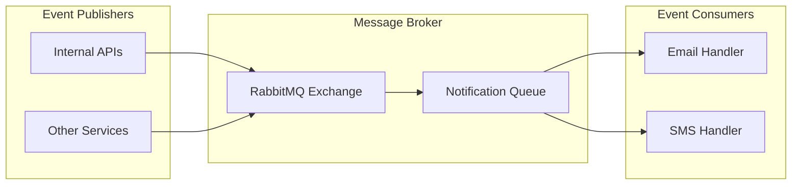

# Notifications API

The Notifications API is a high-performance, asynchronous backend service built with FastAPI. It acts as the centralized notification delivery layer for the Iyconsoft platform, responsible for sending emails and SMS messages through multiple configurable providers, event-driven message processing via RabbitMQ, webhook integrations, and observability.

It is designed with scalability, provider flexibility, and cloud-native deployments in mind.

## 🚀 Key Features

- 📧 **Multi-Provider Email Delivery** via SMTP and Odoo ERP
- 📱 **Multi-Provider SMS Delivery** via SMPP, PSI Mobile, Corporate, and External gateways
- 📨 **Event-Driven Messaging** via RabbitMQ (aio-pika)
- 🏭 **Factory + Strategy Pattern** for pluggable notification providers
- 🛡️ **Enterprise-grade Middleware Stack**
- 📊 **Prometheus Metrics** for monitoring
- 🔔 **Grafana Webhook Alerts** integration
- 🔍 **Centralized Error Handling** with optional Sentry
- 🐳 **Dockerized & CI/CD Ready**

## 🏗️ System Architecture

### High-Level Architecture Diagram

```
┌─────────────────────────────────────────────────────────────────────────────────┐
│                              Client Layer                                       │
├─────────────────┬─────────────────┬─────────────────────────────────────────────┤
│  Internal APIs  │  Grafana Alerts │           RabbitMQ Producers                │
└─────────────────┴─────────────────┴─────────────────────────────────────────────┘
                                    │
                                    ▼
┌─────────────────────────────────────────────────────────────────────────────────┐
│                         Load Balancer / API Gateway                             │
└─────────────────────────────────────────────────────────────────────────────────┘
                                    │
                                    ▼
┌─────────────────────────────────────────────────────────────────────────────────┐
│                         Notifications API Service                               │
├─────────────────────────────────────────────────────────────────────────────────┤
│  API Layer:                                                                     │
│  ┌─────────────────┐    ┌─────────────────────────────────────────────────────┐ │
│  │ FastAPI Routers │ -> │           Middleware Stack                          │ │
│  └─────────────────┘    └─────────────────────────────────────────────────────┘ │
│                                           │                                     │
│  Business Layer:                          ▼                                     │
│  ┌─────────────────┐    ┌─────────────────┐    ┌─────────────────────────────┐ │
│  │Email Repository │    │ SMS Repository  │    │   Event Handler Service     │ │
│  └─────────────────┘    └─────────────────┘    └─────────────────────────────┘ │
│                                           │                                     │
│  Provider Layer:                          ▼                                     │
│  ┌─────────────────┐    ┌─────────────────────────────────────────────────────┐ │
│  │  Email Factory  │    │                SMS Factory                          │ │
│  │  SMTP | ERP     │    │     SMPP | PSI | Corporate | External               │ │
│  └─────────────────┘    └─────────────────────────────────────────────────────┘ │
└─────────────────────────────────────────────────────────────────────────────────┘
                                    │
                                    ▼
┌─────────────────────────────────────────────────────────────────────────────────┐
│                           External Services                                     │
├─────────────────┬─────────────────┬─────────────────┬─────────────────────────┤
│   PostgreSQL/   │    RabbitMQ     │   Odoo ERP      │   SMS Gateways          │
│     SQLite      │                 │   (JSON-RPC)    │ SMPP/PSI/Corporate      │
└─────────────────┴─────────────────┴─────────────────┴─────────────────────────┘
                                    │
                                    ▼
┌─────────────────────────────────────────────────────────────────────────────────┐
│                            Infrastructure                                       │
├─────────────────────────────────┬───────────────────────────────────────────────┤
│        Docker Containers        │      Kubernetes / Docker Compose             │
└─────────────────────────────────┴───────────────────────────────────────────────┘
```

### Layered Architecture

```
┌─────────────────────────────────────────────────────────────────────────────────┐
│                           Presentation Layer                                    │
├─────────────────┬─────────────────┬─────────────────────────────────────────────┤
│ FastAPI Routers │  HTTP Handlers  │        Request/Response Models              │
└─────────────────┴─────────────────┴─────────────────────────────────────────────┘
                                    │
                                    ▼
┌─────────────────────────────────────────────────────────────────────────────────┐
│                         Business Logic Layer                                    │
├─────────────────┬─────────────────┬─────────────────────────────────────────────┤
│Email Repository │ SMS Repository  │           Event Handler                     │
└─────────────────┴─────────────────┴─────────────────────────────────────────────┘
                                    │
                                    ▼
┌─────────────────────────────────────────────────────────────────────────────────┐
│                         Provider / Service Layer                                │
├─────────────────┬─────────────────┬─────────────────────────────────────────────┤
│  Email Factory  │  SMS Factory    │          ERP / Keycloak Services           │
└─────────────────┴─────────────────┴─────────────────────────────────────────────┘
                                    │
                                    ▼
┌─────────────────────────────────────────────────────────────────────────────────┐
│                         Infrastructure Layer                                    │
├─────────────────┬─────────────────┬─────────────────────────────────────────────┤
│Database         │  Message Queue  │           External APIs / SMTP              │
│Connection       │  (RabbitMQ)     │                                             │
└─────────────────┴─────────────────┴─────────────────────────────────────────────┘
```

### Request Flow Architecture

```
Client Request Flow:

Client
  │
  │ HTTP Request
  ▼
Middleware
  │
  │ Validated Request
  ▼
Router
  │
  │ Delegate (BackgroundTask)
  ▼
Repository
  │
  │ get_provider(type)
  ▼
Factory
  │
  │ Provider Instance
  ▼
Provider
  │
  │ Send Email / SMS
  ▼
External Service
  │
  │ Result
  ▼
Repository ──────────────┐
  │                      │
  │ Response Data        │ Publish Event (optional)
  ▼                      ▼
Router               RabbitMQ
  │
  │ HTTP Response
  ▼
Client
```

### Event-Driven Architecture

```
Event-Driven Message Flow:

Publishers                    Message Broker                    Consumers
┌─────────────────┐          ┌─────────────────┐              ┌─────────────────┐
│ Internal APIs   │ ────────▶│  Notification   │ ────────────▶│  Email Handler  │
└─────────────────┘          │     Queue       │              └─────────────────┘
                             └─────────────────┘
┌─────────────────┐          ┌─────────────────┐              ┌─────────────────┐
│  Other Services │ ────────▶│  Notification   │ ────────────▶│  SMS Handler    │
└─────────────────┘          │     Queue       │              └─────────────────┘
                             └─────────────────┘

                             ┌─────────────────┐
                             │    RabbitMQ     │
                             │  Message Broker │
                             └─────────────────┘
                                      │
                        ┌─────────────┴─────────────┐
                        │                           │
                        ▼                           ▼
                ┌─────────────┐             ┌─────────────┐
                │ email type  │             │  sms type   │
                │  handler    │             │   handler   │
                └─────────────┘             └─────────────┘
```

## 🧩 Project Structure

```
.
├── src/
│   ├── constants/              # Global constants
│   ├── core/                   # Core application setup
│   │   ├── config.py           # AppSettings (Pydantic)
│   │   ├── dbconfig.py         # Database configuration
│   │   └── middleware.py       # Middleware registration
│   ├── repositories/           # Business logic orchestration
│   │   ├── email_repository.py
│   │   └── sms_repository.py
│   ├── routers/                # API route handlers
│   │   ├── app_router.py       # / · /health · /metrics
│   │   ├── email_router.py     # /email/send · /email/bulk · /email/webhook
│   │   └── sms_router.py       # /sms/send · /sms/bulk
│   ├── schemas/                # Pydantic request/response models
│   │   └── notification_schema.py
│   ├── services/               # Provider implementations
│   │   ├── email_service.py    # SMTP & ERP providers + EmailServiceFactory
│   │   ├── sms_service.py      # SMPP, PSI, Corporate, External + SMSServiceFactory
│   │   ├── erp_service.py      # Odoo JSON-RPC integration
│   │   └── event_handler.py    # RabbitMQ consumer/producer
│   ├── utils/
│   │   ├── helpers/            # Error handlers, rate limiter, response builders
│   │   └── libs/               # Middleware, logging, Keycloak, Sentry, mailing
│   └── main.py                 # Application entry point
├── templates/                  # Email HTML templates
├── Dockerfile
├── deploy.sh
├── requirements.txt
└── README.md
```

## 🛠️ Tech Stack

- **Python ≥ 3.12**
- **FastAPI**
- **SQLAlchemy (Async)**
- **RabbitMQ (aio-pika)**
- **aiosmtplib** (async email sending)
- **httpx** (async HTTP client)
- **Prometheus**
- **Sentry (optional)**
- **Keycloak (OAuth2/OIDC)**
- **Docker**

## ⚙️ Environment Variables

⚠️ **All values below are placeholders. Never commit real credentials.**

```env
# Application Configuration
APP_NAME=notifications-api
DEBUG=false
APP_VERSION=1.0.0
APP_ORIGINS=["*"]
PORT=8000
SECRET_KEY=<SECRET_KEY>

# Database Configuration
DB_DIALECT=postgresql
DB_SERVER=<DB_HOST>
DB_PORT=<DB_PORT>
DB_USERNAME=<DB_USER>
DB_PASSWORD=<DB_PASSWORD>
DB_NAME=<DB_NAME>
SQLALCHEMY_DATABASE_URI=<DB_URI>

# RabbitMQ Configuration
RABBITMQ_HOST=<RABBITMQ_HOST>
RABBITMQ_PORT=<RABBITMQ_PORT>
RABBITMQ_USERNAME=<RABBITMQ_USER>
RABBITMQ_PASSWORD=<RABBITMQ_PASSWORD>
QUEUE_NAME=<QUEUE_NAME>

# Email (SMTP) Configuration
MAIL_SERVER=<SMTP_HOST>
MAIL_PORT=587
MAIL_SENDER=<FROM_EMAIL>
MAIL_USERNAME=<SMTP_USER>
MAIL_PASSWORD=<SMTP_PASSWORD>
MAIL_FROM_NAME=<DISPLAY_NAME>
MAIL_TLS=true
MAIL_SSL=false

# Odoo ERP Configuration
ODOO_URL=<ODOO_URL>
ODOO_API_KEY=<ODOO_API_KEY>
ODOO_UID=<ODOO_UID>
ODOO_DB=<ODOO_DB>

# SMS Configuration
PISI_URL=https://api.pisimobile.com/

# Authentication (Keycloak)
KEYCLOAK_REALM=<REALM>
KEYCLOAK_SERVER_URL=<KEYCLOAK_URL>
KEYCLOAK_CLIENT_ID=<CLIENT_ID>
KEYCLOAK_CLIENT_SECRET=<CLIENT_SECRET>

# Monitoring
SENTRY_DSN=<SENTRY_DSN>
GRAFANA_WEBHOOK_SECRET=<GRAFANA_SECRET>
GRAFANA_EMAILS=["alert@example.com"]

# Security
API_KEY=<API_KEY>
```

## 🧠 Application Architecture

### Layered Design

```
Router → Repository → Factory → Provider → External Service
                  ↓
           Event Messaging (RabbitMQ)
```

### Responsibilities

- **Routers** → API contracts, HTTP handling, BackgroundTask dispatch
- **Repositories** → Business logic orchestration, input validation
- **Services / Factories** → Provider selection and external delivery
- **Schemas** → Pydantic validation and serialization
- **Utils** → Cross-cutting concerns (errors, logging, rate limiting)

### Core Components

#### 1. Configuration Management

```python
# src/core/config.py
from pydantic_settings import BaseSettings, SettingsConfigDict

class AppSettings(BaseSettings):
    app_name: str
    debug: bool
    port: int
    secret_key: str
    sqlalchemy_database_uri: str
    rabbitmq_host: str
    rabbitmq_port: int
    queue_name: str
    mail_server: str
    mail_port: int
    odoo_url: str
    odoo_api_key: str
    pisi_url: str
    keycloak_realm: str
    sentry_dns: str = None

    model_config = SettingsConfigDict(env_file=".conf")

settings = AppSettings()
```

#### 2. Database Configuration

```python
# src/core/dbconfig.py
from sqlalchemy.ext.asyncio import create_async_engine

engine = create_async_engine(
    settings.sqlalchemy_database_uri,
    echo=settings.debug,
    pool_pre_ping=True,
    pool_size=10,
    max_overflow=5,
    pool_timeout=30,
    pool_recycle=1800
)
```

#### 3. Application Factory

```python
# src/main.py
from contextlib import asynccontextmanager
from src.services import EventHandler_Service

eventrouter_handler = EventHandler_Service()

@asynccontextmanager
async def lifespan(app: FastAPI):
    await eventrouter_handler.connect_rabbitmq(app)
    await eventrouter_handler.register_handler('email', process_email_message, settings.queue_name)
    await eventrouter_handler.register_handler('sms', process_sms_message, settings.queue_name)
    await eventrouter_handler.setup_consumers(app)
    yield
    await eventrouter_handler.stop_all()

app = FastAPI(
    title=settings.app_name,
    version=settings.app_version,
    middleware=middlewares,
    lifespan=lifespan
)
add_app_middlewares(app)
app.include_router(api_router)
```

## 🛡️ Middleware Stack

The application is protected and enhanced with multiple middlewares:

```python
# src/core/middleware.py
middlewares = [
    Middleware(ExceptionMiddleware),
    Middleware(GZipMiddleware, minimum_size=10),
    Middleware(TrustedHostMiddleware, allowed_hosts=settings.app_origins),
    Middleware(SecurityHeadersMiddleware, csp=True),
    Middleware(CORSMiddleware,
        allow_origins=settings.app_origins,
        allow_methods=["*"],
        allow_headers=["*"],
        allow_credentials=True
    ),
    Middleware(SQLAlchemyMiddleware,
        db_url=SQLALCHEMY_DATABASE_URL,
        engine_args=engine_args
    ),
    Middleware(SentryAsgiMiddleware)
]

def add_app_middlewares(app: FastAPI):
    RateLimiter()
    Instrumentator().instrument(app).expose(app)

    if os.getenv("SSL") is True:
        app.add_middleware(HTTPSRedirectMiddleware)
```

### Middleware Features

- **Global Exception Handling**
- **GZip Compression**
- **Trusted Host Validation**
- **Security Headers (CSP)**
- **CORS**
- **SQLAlchemy Session Management**
- **Rate Limiting**
- **Sentry Error Tracking (optional)**
- **HTTPS Redirection (optional)**

## 🏭 Provider Architecture (Factory + Strategy)

### Email Providers

```
EmailServiceFactory
  ├── "smtp"  →  SMTPEmailProvider   (aiosmtplib, direct SMTP delivery)
  └── "erp"   →  ERPEmailProvider    (Odoo JSON-RPC mail.mail)
```

### SMS Providers

```
SMSServiceFactory
  ├── "smpp"       →  LocalSMSProvider      (Iyconsoft SMPP Gateway)
  ├── "pisi"       →  PSISMSProvider        (PSI Mobile REST API)
  ├── "coroperate" →  CORPORATESMSProvider  (Corporate SMS HTTP Gateway)
  └── "external"   →  ExternalSMSProvider   (External REST SMS API)
```

### Factory Implementation

```python
# src/services/email_service.py
class EmailServiceFactory:
    _providers = {
        "smtp": SMTPEmailProvider,
        "erp":  ERPEmailProvider
    }

    @classmethod
    def get_provider(cls, provider_type: str) -> BaseEmailProvider:
        if provider_type not in cls._providers:
            raise ValueError(f"Unknown email provider: {provider_type}")
        return cls._providers[provider_type]()


# src/services/sms_service.py
class SMSServiceFactory:
    _providers = {
        "smpp":      LocalSMSProvider,
        "pisi":      PSISMSProvider,
        "coroperate": CORPORATESMSProvider,
        "external":  ExternalSMSProvider
    }

    @classmethod
    def get_provider(cls, provider_type: str) -> BaseSMSProvider:
        if provider_type not in cls._providers:
            raise ValueError(f"Unknown SMS provider: {provider_type}")
        return cls._providers[provider_type]()
```

### Example API Response

```json
{
  "success": true,
  "message": "Email operation in progress",
  "data": {
    "to_email": "user@example.com",
    "message_id": "<uuid@domain>",
    "status": "sent",
    "provider": "SMTP",
    "timestamp": "2026-01-28T10:30:00Z"
  }
}
```

## 📨 Event Handler Service (RabbitMQ)

### Event-Driven Architecture



### Capabilities

- Robust RabbitMQ connection with `connect_robust`
- Per-queue channel management
- Message type routing via handler registry
- Automatic retry & requeue on failure
- Dead-letter ready
- Fully async message processing
- Graceful shutdown with task cancellation

### Register a Message Handler

```python
await eventrouter_handler.register_handler(
    message_type="email",
    callback=process_email_message,
    queue_name=settings.queue_name
)
```

### Message Processing Flow

```
Publisher → Queue → Consumer → Route by type → Handler → ACK / REQUEUE
```

### Send a Notification via Queue

```python
from src.main import eventrouter_handler
from src.core import settings

await eventrouter_handler.send_message(
    body={
        "type": "email",
        "payload": {
            "to_email": "user@example.com",
            "subject": "Hello",
            "body": "Notification body",
            "provider": "smtp"
        }
    },
    queue_name=settings.queue_name
)
```

### Event Handler Implementation

```python
# src/services/event_handler.py
class EventHandler_Service:
    def __init__(self):
        self.connection = None
        self.channels: Dict[str, Channel] = {}
        self.consumer_tasks: Dict[str, asyncio.Task] = {}
        self.handlers: Dict[str, Dict[str, Callable]] = {}

    async def connect_rabbitmq(self, app):
        self.connection = await connect_robust(
            host=settings.rabbitmq_host,
            port=settings.rabbitmq_port,
            login=settings.rabbitmq_username,
            password=settings.rabbitmq_password,
        )

    async def process_incoming_message(self, message: IncomingMessage, queue_name: str):
        body = json.loads(message.body.decode())
        message_type = body.get('type')
        handler = self.handlers.get(queue_name, {}).get(message_type)

        if handler:
            async with message.process():
                await handler(body)
        else:
            await message.reject(requeue=False)
```

## 🗄️ Database Layer

### Database Architecture

```
Database Layer Architecture:

┌─────────────────────────────────────────────────────────────────────────────────┐
│                           Application Layer                                     │
├─────────────────────────────────────────────────────────────────────────────────┤
│                          Repository Layer                                       │
└─────────────────────────────────────────────────────────────────────────────────┘
                                    │
                                    ▼
┌─────────────────────────────────────────────────────────────────────────────────┐
│                          Data Access Layer                                      │
├─────────────────┬───────────────────────────────────────────────────────────────┤
│  Repositories   │                SQLAlchemy Models                              │
└─────────────────┴───────────────────────────────────────────────────────────────┘
                                    │
                                    ▼
┌─────────────────────────────────────────────────────────────────────────────────┐
│                           Database Layer                                        │
├─────────────────┬─────────────────┬─────────────────────────────────────────────┤
│  Async Engine   │Connection Pool  │      Database (PostgreSQL/SQLite)          │
└─────────────────┴─────────────────┴─────────────────────────────────────────────┘
```

### Features

- Fully asynchronous SQLAlchemy engine
- Connection pooling (size: 10, max overflow: 5, recycle: 1800s)
- Supports SQLite (local) and PostgreSQL/MySQL (production)
- Dialect-driven URI construction

## 📊 Observability

### Monitoring Architecture

```
Monitoring and Observability Stack:

┌─────────────────────────────────────────────────────────────────────────────────┐
│                         Notifications API                                       │
├─────────────────┬───────────────────────────────────────────────────────────────┤
│  FastAPI App    │                Metrics Endpoint (/metrics)                   │
└─────────────────┴───────────────────────────────────────────────────────────────┘
          │                                │
          │ Error Tracking                 │ Metrics Collection
          ▼                                ▼
┌─────────────────┐                ┌─────────────────┐
│     Sentry      │                │   Prometheus    │
│  Error Tracking │                │  Metrics Store  │
└─────────────────┘                └─────────────┬───┘
                                                 │
                                                 │ Visualization
                                                 ▼
                                       ┌─────────────────┐
                                       │     Grafana     │
                                       │  Dashboards &   │
                                       │  Visualization  │
                                       └─────────────┬───┘
                                                     │
                                                     │ Alerting (Webhook)
                                                     ▼
                                    ┌────────────────────────────────┐
                                    │  POST /email/webhook           │
                                    │  (x-grafana-token validated)   │
                                    └────────────────────────────────┘
```

### Health Check Endpoint

`GET /health` checks all external dependencies:

```
┌─────────────────────────────────────────────────────────────────────────────────┐
│                            Health Check                                         │
├─────────────────┬─────────────────┬─────────────────┬───────────────────────────┤
│    RabbitMQ     │    Database     │   Odoo ERP      │  SMPP / PSI / Corporate  │
└─────────────────┴─────────────────┴─────────────────┴───────────────────────────┘
```

### Metrics & Error Tracking

```python
# Prometheus - auto-instrumented
from prometheus_fastapi_instrumentator import Instrumentator
Instrumentator().instrument(app).expose(app)

# Sentry - optional
import sentry_sdk
if settings.sentry_dns:
    sentry_sdk.init(dsn=settings.sentry_dns)
```

## 🐳 Docker

### Container Architecture

```
Docker Environment Structure:

┌─────────────────────────────────────────────────────────────────────────────────┐
│                           Docker Environment                                    │
├─────────────────────────────────────────────────────────────────────────────────┤
│                                                                                 │
│  ┌─────────────────────────────────────────────────────────────────────────┐   │
│  │                    Application Container                                │   │
│  ├─────────────────┬───────────────────────────────────────────────────────┤   │
│  │ Notifications   │        Python 3.12 Alpine                            │   │
│  │     API         │  Dev: Hypercorn 2 workers (port 8000)                │   │
│  │                 │  Prod: Gunicorn 8 Uvicorn workers (port 8053)        │   │
│  └─────────────────┴───────────────────────────────────────────────────────┘   │
│                                      │                                         │
│                                      │ Connects to                             │
│                                      ▼                                         │
│  ┌─────────────────────────────────────────────────────────────────────────┐   │
│  │                    Database Container                                   │   │
│  ├─────────────────────────────────────────────────────────────────────────┤   │
│  │                  PostgreSQL / SQLite                                    │   │
│  └─────────────────────────────────────────────────────────────────────────┘   │
│                                      │                                         │
│                                      │ Message Queue                           │
│                                      ▼                                         │
│  ┌─────────────────────────────────────────────────────────────────────────┐   │
│  │                 Message Queue Container                                 │   │
│  ├─────────────────────────────────────────────────────────────────────────┤   │
│  │                      RabbitMQ                                           │   │
│  └─────────────────────────────────────────────────────────────────────────┘   │
│                                      │                                         │
│                                      │ Monitoring                              │
│                                      ▼                                         │
│  ┌─────────────────────────────────────────────────────────────────────────┐   │
│  │                  Monitoring Container                                   │   │
│  ├─────────────────────────────────────────────────────────────────────────┤   │
│  │                     Prometheus                                          │   │
│  └─────────────────────────────────────────────────────────────────────────┘   │
│                                                                                 │
└─────────────────────────────────────────────────────────────────────────────────┘
```

### Development Mode

```bash
docker-compose -f docker-compose-debug.yml up
```

### Production Build

```bash
docker build --target prod -t notifications-api .
docker run -p 8053:8053 notifications-api
```

### Dockerfile (Multi-Stage)

```dockerfile
# Build stage
FROM python:3.12-alpine3.20 AS builder
WORKDIR /usr/src/iyconsoftNotifications
RUN python -m venv /opt/venv
ENV PATH="/opt/venv/bin:$PATH"
COPY requirements.txt .
RUN pip install --no-cache-dir -r requirements.txt

# Dev stage
FROM python:3.12-alpine3.20 AS dev
WORKDIR /usr/src/iyconsoftNotifications
COPY --from=builder /opt/venv /opt/venv
COPY . .
EXPOSE 8000
CMD ["hypercorn", "src.main:app", "--workers", "2", "--bind", "0.0.0.0:8000", "--worker-class", "uvloop"]

# Prod stage — non-root user
FROM python:3.12-alpine3.20 AS prod
RUN addgroup -S developer && adduser -S developer -G developer
RUN python3 -m venv /opt/venv
USER developer
COPY --chown=developer:developer . /usr/src/iyconsoftNotifications/
WORKDIR /usr/src/iyconsoftNotifications
EXPOSE 8053
CMD ["gunicorn", "--bind", "0.0.0.0:8053", "-w", "8", "-k", "uvicorn.workers.UvicornWorker", "src.main:app"]
```

## 🔐 Security Best Practices

### Security Architecture

```
Multi-Layer Security Approach:

┌─────────────────────────────────────────────────────────────────────────────────┐
│                            Security Layers                                      │
├─────────────────────────────────────────────────────────────────────────────────┤
│                                                                                 │
│  ┌─────────────────────────────────────────────────────────────────────────┐   │
│  │                      Network Security                                   │   │
│  ├─────────────────┬───────────────────────────────────────────────────────┤   │
│  │    Firewall     │                   TLS/SSL                            │   │
│  └─────────────────┴───────────────────────────────────────────────────────┘   │
│                                      │                                         │
│                                      ▼                                         │
│  ┌─────────────────────────────────────────────────────────────────────────┐   │
│  │                   Application Security                                  │   │
│  ├─────────────────┬─────────────────┬───────────────────────────────────────┤   │
│  │  API Key Auth   │ Grafana Tokens  │     Input Validation (Pydantic)       │   │
│  └─────────────────┴─────────────────┴───────────────────────────────────────┘   │
│                                      │                                         │
│                                      ▼                                         │
│  ┌─────────────────────────────────────────────────────────────────────────┐   │
│  │                 Infrastructure Security                                 │   │
│  ├─────────────────┬───────────────────────────────────────────────────────┤   │
│  │Container        │              Secret Management (.conf)                │   │
│  │Non-root user    │                                                       │   │
│  └─────────────────┴───────────────────────────────────────────────────────┘   │
│                                                                                 │
└─────────────────────────────────────────────────────────────────────────────────┘
```

### Security Features

- **Non-root container execution** (`developer` user in prod)
- **Environment-based secrets** via `.conf` file
- **Input validation** via Pydantic schemas
- **Rate limiting** via custom RateLimiter
- **Secure HTTP headers** (CSP, X-Frame-Options, X-XSS-Protection)
- **CORS configuration** per environment
- **Grafana webhook token** validation
- **SQL injection prevention** via SQLAlchemy ORM

## 🚀 Deployment

### Deployment Architecture

```
Production Deployment Structure:

┌─────────────────────────────────────────────────────────────────────────────────┐
│                            CI/CD Pipeline                                       │
├─────────────────┬─────────────────┬─────────────────┬───────────────────────────┤
│ Git Repository  │   Build Stage   │   Test Stage    │      Deploy Stage         │
└─────────────────┴─────────────────┴─────────────────┴───────────────────────────┘
                                                                │
                                                                ▼
┌─────────────────────────────────────────────────────────────────────────────────┐
│                         Production Environment                                  │
├─────────────────────────────────────────────────────────────────────────────────┤
│                                                                                 │
│  ┌─────────────────────────────────────────────────────────────────────────┐   │
│  │                      Load Balancer                                      │   │
│  └─────────────────────────────┬───────────────────────────────────────────┘   │
│                                │                                               │
│                    ┌───────────┴───────────┐                                   │
│                    ▼                       ▼                                   │
│  ┌──────────────────────────────┐ ┌──────────────────────────────┐             │
│  │  Notifications Instance 1   │ │  Notifications Instance 2   │             │
│  └──────────────────┬───────────┘ └──────────────────┬───────────┘             │
│                     │                                 │                        │
│                     └───────────────┬─────────────────┘                        │
│                                     ▼                                          │
│  ┌─────────────────────────────────────────────────────────────────────────┐   │
│  │                    Database Cluster                                     │   │
│  └─────────────────────────────────────────────────────────────────────────┘   │
│                                                                                 │
└─────────────────────────────────────────────────────────────────────────────────┘
```

### Deployment Script

```bash
#!/bin/bash
# deploy.sh
set -e

echo "Deploying Notifications API..."

docker build --target prod -t notifications-api:latest .

docker-compose up -d --no-deps --build notifications-api

echo "Deployment completed successfully!"
```

## 📌 Summary

The Notifications API provides a robust, scalable, and production-ready notification delivery service for the Iyconsoft platform, combining:

- **Modern async Python** with FastAPI
- **Clean layered architecture** with clear separation of concerns
- **Provider abstraction** via Factory + Strategy patterns for easy extensibility
- **Event-driven design** with RabbitMQ for decoupled async delivery
- **Multi-channel support** — Email (SMTP, ERP) and SMS (SMPP, PSI, Corporate, External)
- **Enterprise-grade observability** with Prometheus, Sentry, and Grafana webhooks
- **Comprehensive security** with multiple middleware layers and non-root containers

### Key Architectural Principles

1. **Separation of Concerns**: Clear boundaries between routing, business logic, and provider delivery
2. **Open/Closed Principle**: New providers can be added without changing existing code
3. **Event-Driven**: Loose coupling through RabbitMQ message queues
4. **Async-First**: Non-blocking I/O throughout for high throughput
5. **Observability**: Health checks, metrics, and error tracking built-in
6. **Security**: Defense in depth with multiple security layers

This architecture ensures the Notifications API can scale horizontally, support new notification channels with minimal effort, and maintain high availability across the Iyconsoft platform.

---

**Built with FastAPI, SQLAlchemy, RabbitMQ, and modern Python patterns for enterprise-grade notification delivery.**
